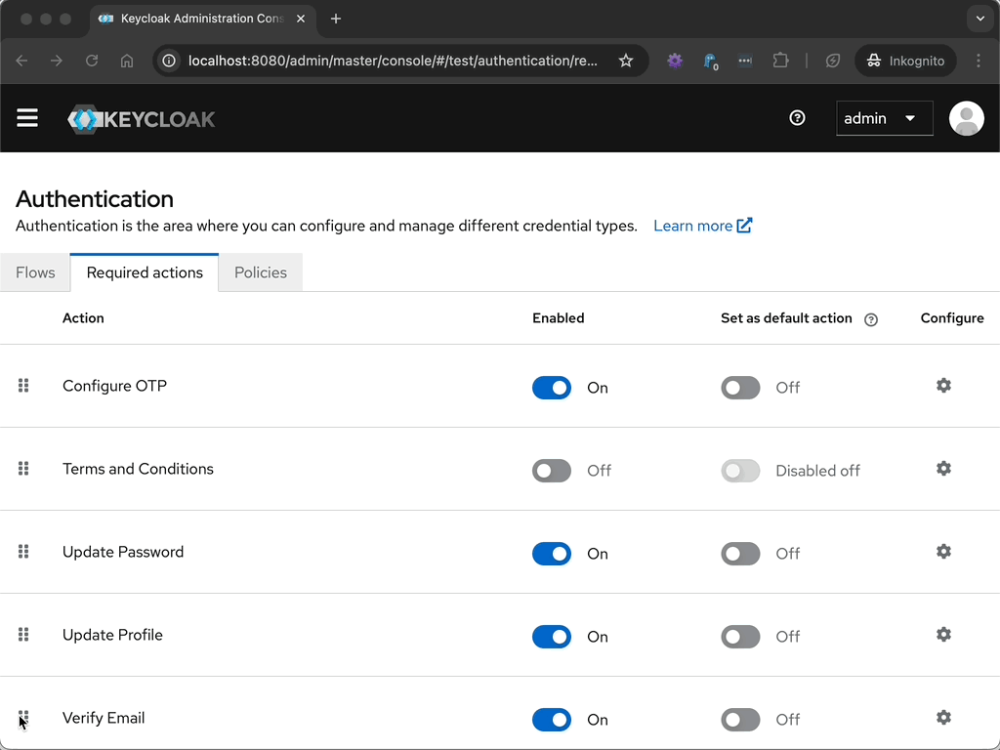

# ZLB Keycloak Extensions

## General

These custom extensions are based on

### Building the Binaries

You can build the binaries if you have a local installation of JDK, with

    $ ./mvnw clean package

If you don't have local JDK installation, but Docker is available, you can use the helper script

    $ ./build-with-docker.sh

Both approaches will build the binary `target/keycloak-extensions.jar`.

### Download the Binaries

Alternatively to building the binaries yourself, you can also download them from GitHub actions.

Go to https://github.com/dasniko/zlb-keycloak/actions/workflows/maven.yml and click on the most recent workflow run.

In the details of this execution, you can find the section `Artifacts` with the `ext-jar` artifact listed.
Here you can download the artifact up until 90 days after the last build time.

### Deployment

Deploy the built JAR file into the `$KEYCLOAK_HOME/providers` folder of your Keycloak server (or copy it to your Docker image).

When running Keycloak in `optimized` mode, you'll have to run a `build` after deploying the JAR.
If you start Keycloak regularly, an implicit build will be performed.
See [Keycloak Docs](https://www.keycloak.org/docs) and [Keycloak Guides](https://www.keycloak.org/guides) for more info.

## Extensions

### Periodic Verify Email Action

The `PeriodicVerifyEmail` action extends and automatically overloads the built-in required action `VERIFY_EMAIL`.

It tests periodically if a user has to re-verify its email address.
To configure the duration how often a user has to re-verify the email, see here:

### Extended Verify Email Action Token Handler

The `ExtendedVerifyEmailActionTokenHandler` extends and automatically overloads the built-in action token handler.

It adds setting the `verifiedEmailAt` attribute to the current timestamp when the user confirms/verifies its email via the action token link.
